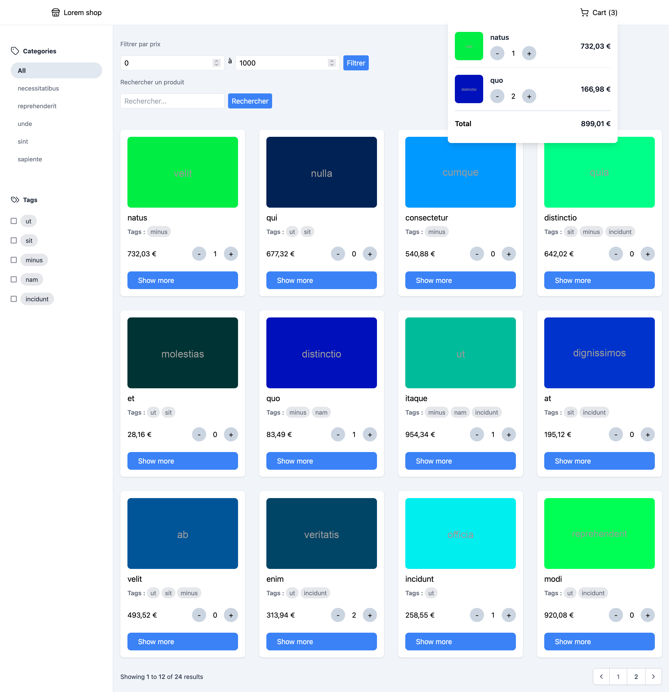
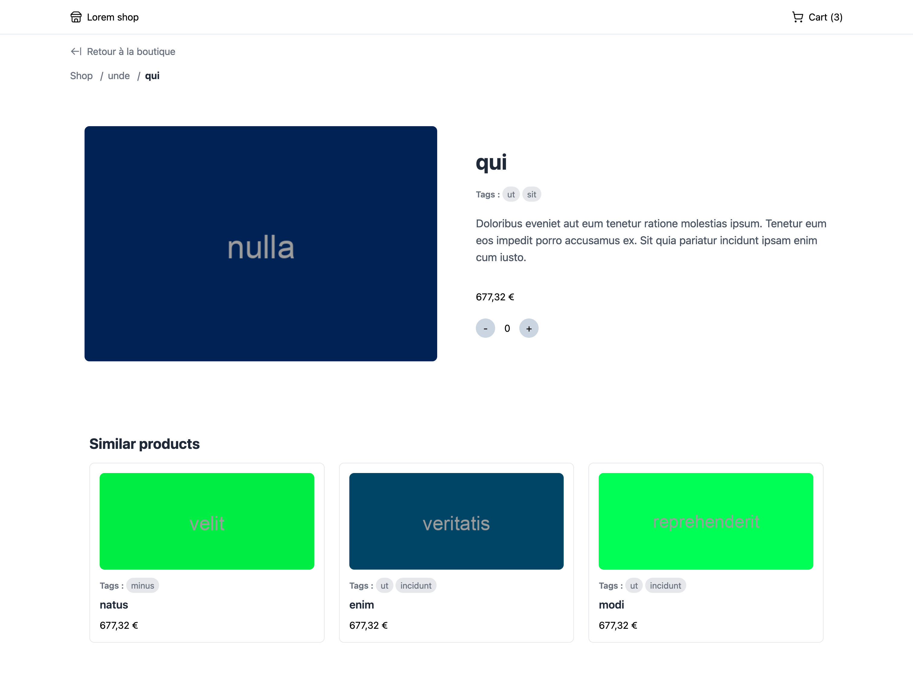

# Lorem Shop: Laravel Ecommerce

## Objectif

Ce projet a été développé dans le cadre d'un cours pour s'entraîner à Laravel en utilisant Livewire et Alpine.js. Il vise à créer une plateforme de ecommerce simple et fonctionnelle.

## Fonctionnalités

- **Gestion du panier** : Stockage des articles dans la session pour une expérience d'achat fluide.
- **Gestion des catégories et des tags** : Organisation des produits par catégories et tags pour faciliter la navigation.
- **Filtrage des prix et recherche** : Permet aux utilisateurs de filtrer les produits selon le prix et de rechercher des articles spécifiques.
- **Page produit** : Affiche les détails des produits avec une interface conviviale.
- **Affichage avec Livewire et Blade** : Utilisation de composants Livewire et de Blade pour un rendu dynamique et réactif.

## Pages

- **Page du Shop**  
  

- **Page Produit**  
  

## Installation

Pour lancer le projet, suivez les étapes ci-dessous :

1. Clonez le dépôt :
   ```bash
   git clone https://github.com/Killian-Habasque/laravel-ecommerce.git
   cd laravel-ecommerce

2. Installez les dépendances avec Composer :
    ```bash
    composer install

3. Installez les dépendances front-end avec npm :
    ```bash
    npm install

4. Compilez les fichiers CSS et JavaScript :
    ```bash
    npm run dev

5. Configurez votre fichier .env :
    ```bash
    cp .env.example .env
    php artisan key:generate

6. Exécutez les migrations et les seeders pour peupler la base de données :
    ```bash
    php artisan migrate --seed

7. Démarrez le serveur de développement :
    ```bash
    php artisan serve

Votre application devrait maintenant être accessible à l'adresse http://localhost:8000.